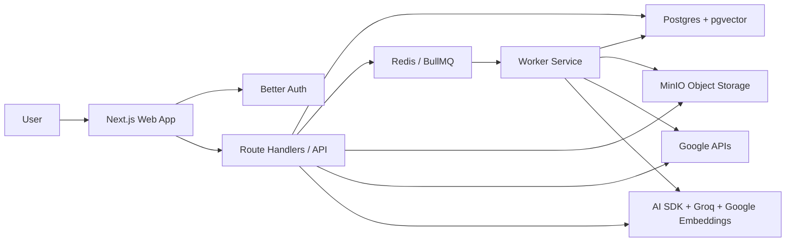
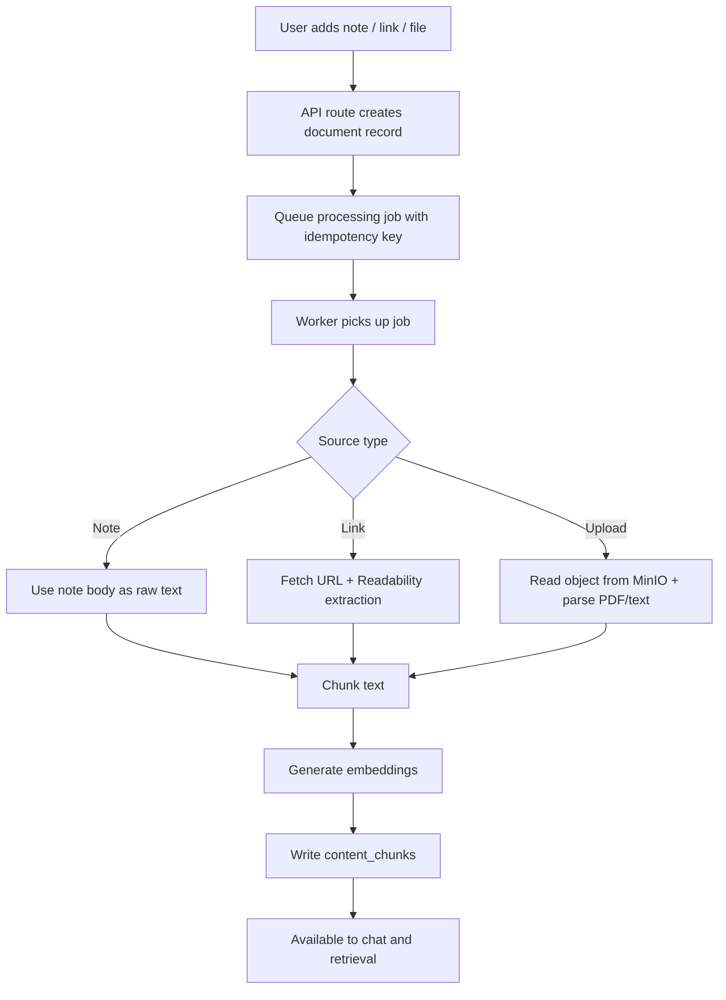
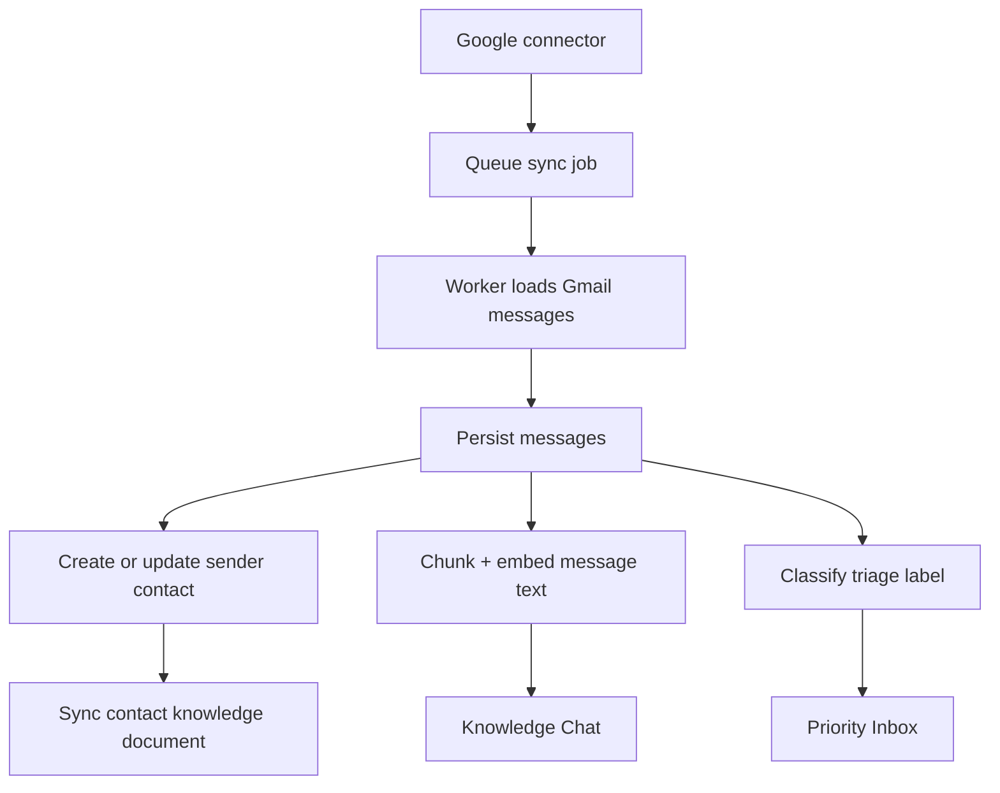
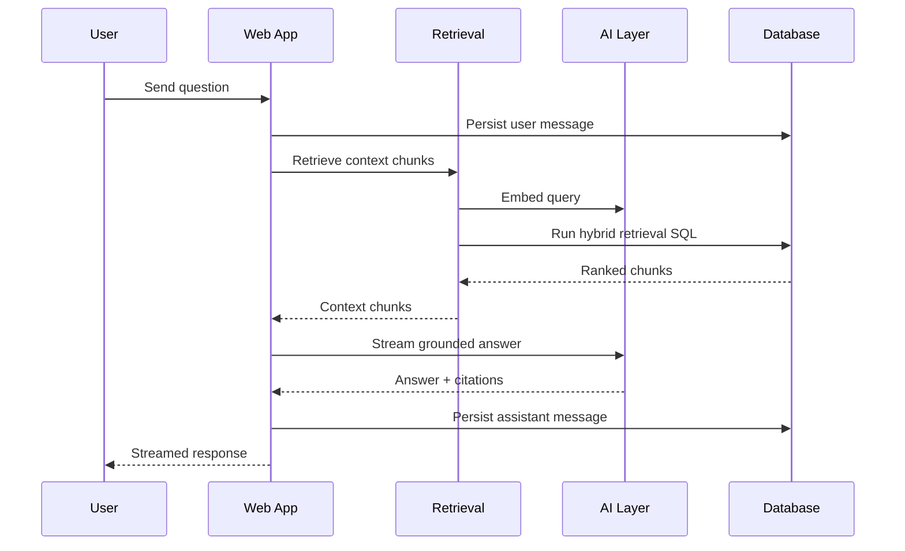
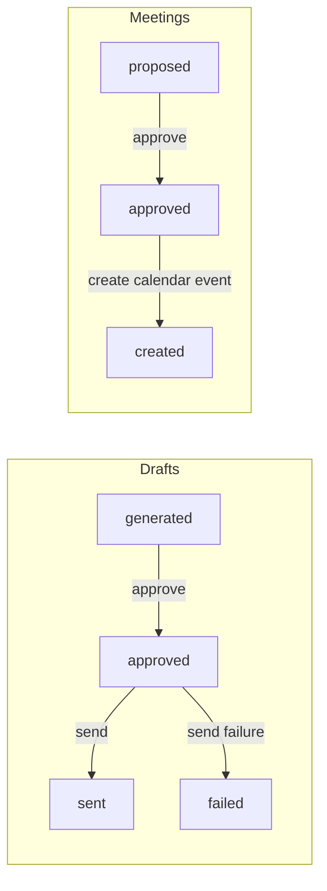
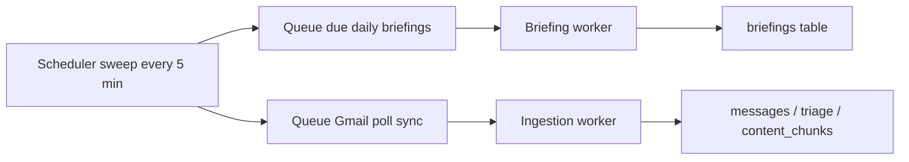
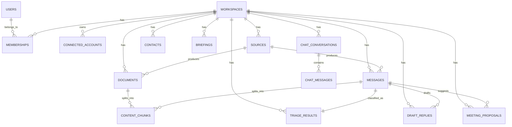

# Syntheci

Syntheci is an AI workspace for turning scattered operational context into an actionable system.

It combines:

- a priority inbox
- a grounded knowledge chat with citations
- note, link, and file ingestion
- contact enrichment
- daily briefings
- approval-driven email drafting
- approval-driven meeting creation

All of that runs inside a pnpm monorepo built with Next.js, BullMQ, Postgres + pgvector, Redis, MinIO, Better Auth, and the AI SDK.

## Table of Contents

- [Why Syntheci exists](#why-syntheci-exists)
- [What the product does](#what-the-product-does)
- [System architecture](#system-architecture)
- [End-to-end flows](#end-to-end-flows)
- [Repository structure](#repository-structure)
- [Tech stack](#tech-stack)
- [Getting started](#getting-started)
- [Environment variables](#environment-variables)
- [Developer commands](#developer-commands)
- [Important code highlights](#important-code-highlights)
- [Data model](#data-model)
- [API surface](#api-surface)
- [Testing](#testing)
- [Operational notes](#operational-notes)
- [Current MVP constraints](#current-mvp-constraints)

## Why Syntheci exists

Most work does not fail because information is unavailable. It fails because information is fragmented across email threads, notes, uploaded docs, links, calendar context, and human memory.

Syntheci is designed to act like a second operational brain:

- ingest what matters
- normalize it into a canonical store
- rank what needs attention
- answer questions with evidence
- propose actions
- require explicit human approval before high-impact sends or calendar creation

The result is a workspace that is useful both as a demoable hackathon MVP and as a serious architecture for retrieval, triage, and approval-based automation.

## What the product does

### 1. Authentication and workspace bootstrap

- Better Auth powers sign-in and session handling.
- Every authenticated user gets a workspace automatically.
- A demo account can be bootstrapped and signed into without connecting a real Google account.

### 2. Gmail sync and priority inbox

- Users can connect Google accounts for Gmail + Calendar access.
- Gmail sync imports inbox messages, stores canonical message records, and indexes them for retrieval.
- Each imported message is triaged into one label:
  - `urgent`
  - `needs_reply`
  - `follow_up`
  - `scheduling`
  - `informational`
- The inbox UI ranks messages using label weight, unread state, and confidence.

### 3. Contact graph and contact knowledge

- Incoming email senders are turned into contact records.
- Contacts are also converted into synthetic knowledge documents and embedded into the retrieval system.
- That means chat can answer questions about people, not just messages and documents.

### 4. Ingestion pipeline

Syntheci can ingest three non-email document sources:

- notes
- links
- uploaded files

Each path ends in the same outcome:

1. store a canonical `document`
2. extract or normalize text
3. chunk the text
4. generate embeddings
5. write `content_chunks`

The ingestion dashboard now also includes a searchable document library for browsing notes, links, and uploads in one place.

### 5. Grounded chat with citations

- Chat uses retrieval-augmented generation over `content_chunks`.
- Retrieval blends vector similarity, PostgreSQL full-text ranking, and source-specific rank boosts.
- Conversations are persisted.
- Assistant responses include citations back to the underlying message or document.

### 6. Daily briefings

- A worker scheduler checks workspaces regularly.
- At 09:00 local workspace time, it queues a daily briefing if one has not already been generated for that day.
- Briefings summarize urgent items, follow-ups, open threads, and near-term meetings.

### 7. Draft Center

- Draft replies can be generated from inbox messages.
- Drafts are intentionally approval-driven:
  - `generated`
  - `approved`
  - `sent`
  - `failed`
- Nothing is sent until the user explicitly approves it.

### 8. Meeting Center

- Scheduling intent can be extracted from messages.
- Meeting proposals are persisted and can be edited.
- Proposals also follow an approval state machine:
  - `proposed`
  - `approved`
  - `created`
  - `rejected`
- Calendar events are only created after approval.

### 9. Demo mode

The repo ships with a strong seeded demo experience:

- demo auth user
- demo Gmail connector
- demo messages
- demo contacts
- demo notes
- demo links
- demo uploads
- demo briefings
- demo meetings
- demo chat history

This makes the system reviewable end-to-end even without real Google credentials.

## System architecture



### Runtime responsibilities

| Layer | Responsibility |
| --- | --- |
| `apps/web` | UI, auth, route handlers, queue producers, retrieval, action APIs |
| `apps/worker` | background processing, extraction, indexing, Gmail sync, briefings, scheduler |
| `packages/db` | schema, Drizzle client, migrations, DB helpers |
| `packages/ai` | chat, embeddings, triage, briefing, draft, meeting extraction |
| `packages/shared` | shared schemas, queue contracts, demo fixtures, constants |

## End-to-end flows

### Ingestion flow



### Gmail sync, triage, and contact enrichment



### Chat retrieval sequence



### Approval-driven action model



### Daily scheduler flow



## Repository structure

```text
.
|-- apps
|   |-- web
|   |   |-- app
|   |   |   |-- api
|   |   |   |-- dashboard
|   |   |   `-- login
|   |   |-- components
|   |   `-- lib
|   `-- worker
|       `-- src
|           |-- services
|           `-- utils
|-- packages
|   |-- ai
|   |-- db
|   `-- shared
|-- docker-compose.yml
|-- package.json
`-- pnpm-workspace.yaml
```

## Tech stack

### Frontend and application layer

- Next.js 16 App Router
- React 19
- TypeScript
- Tailwind CSS 4
- Motion
- shadcn/base-ui primitives
- AI SDK / `@ai-sdk/react`

### Backend and infrastructure

- Better Auth
- Drizzle ORM
- PostgreSQL + pgvector
- Redis
- BullMQ
- MinIO
- Docker Compose

### AI providers

- Groq for text/object generation
- Moonshot Kimi model via Groq for chat-style tasks
- Google embeddings for vector search

## Getting started

### Prerequisites

- Node.js 20+
- pnpm 10+
- Docker Desktop or compatible Docker runtime

### Option A: full Docker startup

This is the easiest path if you want the whole stack running in containers.

```bash
pnpm install
cp .env.example .env
pnpm compose:up
```

Open:

- App: `http://localhost:3000`
- MinIO API: `http://localhost:9000`
- MinIO Console: `http://localhost:9001`

### Option B: local app + worker, Docker infra only

This is the nicest developer loop when editing code.

```bash
pnpm install
cp .env.example .env
pnpm compose:dev
pnpm dev:web
pnpm dev:worker
```

`compose:dev` starts:

- Postgres
- Redis
- MinIO
- MinIO bucket initialization
- demo bootstrap

Then you run the web app and worker locally.

### Demo login

With `DEMO_MODE_ENABLED=true`, the login page exposes a demo sign-in flow that authenticates into the seeded workspace.

Default demo credentials:

- Email: `demo@syntheci.local`
- Password: `demo-password-123`

In the UI, you can simply click `Use demo account`.

### Rebuilding after public env changes

If you change a `NEXT_PUBLIC_*` variable such as `NEXT_PUBLIC_APP_URL`, rebuild the web image:

```bash
docker compose build web
docker compose up -d web
```

## Environment variables

The root `.env.example` is already a good source of truth. The table below explains what each variable actually controls.

| Variable | Purpose |
| --- | --- |
| `NODE_ENV` | Runtime mode |
| `NEXT_PUBLIC_APP_URL` | Public frontend URL baked into the Next.js app |
| `APP_BASE_URL` | Server-side base URL for OAuth callbacks and internal references |
| `DATABASE_URL` | PostgreSQL connection string |
| `REDIS_URL` | Redis connection string for BullMQ |
| `MINIO_ENDPOINT` | MinIO/S3 endpoint |
| `MINIO_REGION` | MinIO region |
| `MINIO_ACCESS_KEY` | MinIO access key |
| `MINIO_SECRET_KEY` | MinIO secret key |
| `MINIO_BUCKET` | Bucket for uploaded assets |
| `MINIO_PUBLIC_URL` | Public URL used when generating object links |
| `BETTER_AUTH_SECRET` | Secret used by Better Auth and encryption helpers |
| `BETTER_AUTH_URL` | Better Auth base URL |
| `DEMO_MODE_ENABLED` | Enables demo login and bootstrap behavior |
| `DEMO_ACCOUNT_EMAIL` | Demo auth email |
| `DEMO_ACCOUNT_PASSWORD` | Demo auth password |
| `DEMO_ACCOUNT_NAME` | Demo user display name |
| `GOOGLE_CLIENT_ID` | Google OAuth client id |
| `GOOGLE_CLIENT_SECRET` | Google OAuth client secret |
| `GOOGLE_CALENDAR_SCOPES` | Additional calendar scopes configuration |
| `GOOGLE_GENERATIVE_AI_API_KEY` | Google AI API key for embeddings |
| `GOOGLE_EMBEDDING_MODEL` | Embedding model name |
| `GROQ_API_KEY` | Groq API key |
| `GROQ_CHAT_MODEL` | Chat/object generation model |
| `WORKER_CONCURRENCY` | Worker concurrency for BullMQ workers |

### Notes

- `BETTER_AUTH_SECRET` should be long and random. The code validates a minimum length of 20.
- Google sign-in and Google connector flows both depend on valid OAuth setup.
- MinIO is used as S3-compatible object storage for uploads.

## Developer commands

### Root commands

```bash
pnpm dev
pnpm dev:web
pnpm dev:worker
pnpm build
pnpm lint
pnpm test
pnpm typecheck
pnpm db:migrate
pnpm db:generate
pnpm compose:up
pnpm compose:dev
pnpm compose:down
```

### Useful URLs

- `/login`
- `/dashboard`
- `/dashboard/chat`
- `/dashboard/inbox`
- `/dashboard/ingestion`
- `/dashboard/drafts`
- `/dashboard/meetings`
- `/api/health`
- `/api/connectors/health`

## Important code highlights

These are some of the most important pieces of logic in the repo.

### 1. New users automatically get a workspace

Syntheci treats workspace creation as part of authentication, not a separate setup step.

```ts
databaseHooks: {
  user: {
    create: {
      after: async (user) => {
        await ensureWorkspaceForUser({
          id: user.id,
          email: user.email,
          name: user.name ?? user.email,
          image: user.image
        });
      }
    }
  }
}
```

Why it matters:

- eliminates post-signup setup friction
- guarantees every session can resolve to a workspace
- keeps downstream APIs simple because they can assume workspace context exists

### 2. Retrieval is hybrid, not pure vector search

The retrieval layer blends semantic similarity, text ranking, and source boosts.

```sql
(
  (1 - (cc.embedding <=> $query_vector::vector)) * 0.72 +
  ts_rank_cd(
    to_tsvector('simple', cc.content),
    plainto_tsquery('simple', $question)
  ) * 0.23 +
  cc.rank_boost * 0.05
) as score
```

Why it matters:

- vector similarity alone is often weak for operational text
- full-text helps exact term matching
- `rank_boost` lets the system favor certain sources like message text or contact knowledge

### 3. Contacts become retrieval-ready knowledge

Contacts are not just metadata rows. They are turned into synthetic documents and embedded.

```ts
const rawText = buildContactProfileText(input.contact);
const [embedding] = await embedTexts([rawText]);
await db.insert(contentChunks).values({
  workspaceId: input.workspaceId,
  sourceId: input.sourceId,
  documentId: document.id,
  content: rawText,
  tokenCount: estimateTokenCount(rawText),
  embedding,
  rankBoost: 1.2
});
```

Why it matters:

- chat can answer people-centric questions
- contacts and documents share the same retrieval substrate
- the contact graph becomes part of the knowledge base automatically

### 4. Action execution is guarded by explicit approval

Draft replies cannot be sent unless they are already approved.

```ts
if (draft.status !== "approved") {
  return NextResponse.json(
    { error: "draft must be approved before send" },
    { status: 400 }
  );
}
```

Meeting proposals use the same pattern before calendar creation.

Why it matters:

- keeps the product assistive instead of fully autonomous
- reduces accidental external side effects
- makes the approval trail explicit in the database

### 5. Queue jobs are idempotent and audited

Jobs are tracked with deterministic keys and an audit table.

```ts
await params.queue.add(params.name, params.payload, {
  jobId: params.payload.idempotencyKey,
  removeOnComplete: 500,
  removeOnFail: 2000,
  attempts: 4,
  backoff: {
    type: "exponential",
    delay: 2000
  }
});
```

Why it matters:

- duplicate work is easier to avoid
- failures become inspectable
- retries are safe and intentional

### 6. Daily briefing generation is time-zone aware

The scheduler only queues a briefing when the workspace is at 09:00 local time and one has not already been generated.

```ts
const hour = getHourInTimezone(now, workspace.timezone);
if (hour !== 9) continue;

const briefingDate = formatDateInTimezone(now, workspace.timezone);
const existing = await db.query.briefings.findFirst({
  where: and(
    eq(briefings.workspaceId, workspace.id),
    eq(briefings.briefingDate, briefingDate)
  )
});
if (existing) continue;
```

Why it matters:

- prevents duplicate daily briefs
- preserves the mental model of "my morning briefing"
- shows the worker is not just reactive, it is also scheduled

## Data model

At a high level, the system revolves around a canonical workspace store.



### Key tables

| Table | Role |
| --- | --- |
| `workspaces` | tenant boundary |
| `connected_accounts` | OAuth-backed external identities |
| `sources` | origin of imported data |
| `messages` | canonical email message store |
| `documents` | canonical note/link/upload/contact document store |
| `content_chunks` | chunked retrieval records with embeddings |
| `triage_results` | single-label message classification |
| `draft_replies` | generated/approved/sent reply lifecycle |
| `meeting_proposals` | extracted/approved/created meeting lifecycle |
| `briefings` | stored daily summaries |
| `chat_conversations` / `chat_messages` | persistent chat history |
| `jobs_audit` | queue/audit visibility |

## API surface

This is the most important route surface in the project today.

### Auth and session

- `GET/POST /api/auth/[...all]`
- `POST /api/demo/sign-in`

### Connectors

- `GET /api/connect/google/start`
- `GET /api/connect/google/callback`
- `POST /api/connectors/google/sync`
- `GET /api/connectors/health`

### Ingestion

- `POST /api/notes`
- `POST /api/links`
- `POST /api/uploads/presign`
- `POST /api/uploads/complete`

### Inbox and actions

- `POST /api/triage`
- `POST /api/drafts`
- `POST /api/drafts/[draftId]/approve`
- `POST /api/drafts/[draftId]/send`
- `POST /api/meetings/proposals`
- `PATCH /api/meetings/proposals/[proposalId]`
- `POST /api/meetings/proposals/[proposalId]/approve`
- `POST /api/meetings/proposals/[proposalId]/create`
- `GET /api/meetings/calendar`

### Chat

- `POST /api/chat`
- `GET/POST /api/chat/conversations`
- `GET/PATCH/DELETE /api/chat/conversations/[conversationId]`

### Health

- `GET /api/health`

## Testing

The repo includes route-level and package-level tests across the web app, worker, AI package, DB helpers, and shared schemas.

Project test files currently present: `27`

Examples include:

- chat conversation API tests
- Google sync route tests
- draft approval/send tests
- meeting proposal approval/create tests
- retrieval tests
- scheduler tests
- chunking tests
- schema tests

Run everything with:

```bash
pnpm test
```

And type-check with:

```bash
pnpm typecheck
```

## Operational notes

### Demo bootstrap

The `bootstrap` service seeds the demo environment. It:

- ensures auth schema compatibility
- creates the demo user
- resets the demo workspace
- seeds messages, contacts, documents, meetings, briefs, and chat history
- uploads demo assets into MinIO

This is why the demo path feels complete instead of empty.

### Storage model

- canonical metadata lives in Postgres
- binary assets live in MinIO
- background work is coordinated through BullMQ + Redis
- retrieval embeddings are stored directly in Postgres via pgvector

### Health checks

- `/api/health` checks database reachability
- `/api/connectors/health` lists connector status for the current workspace

### Gmail sync model

The current implementation uses:

- initial recent inbox sync
- incremental history-based sync when a history cursor exists
- periodic polling via the worker scheduler

That means the Gmail connector is functional even without push webhook infrastructure.

## Current MVP constraints

This repo is already substantial, but it is still an MVP in a few important ways.

### 1. Some future integration surfaces are scaffolded but not implemented

There are route folders reserved for:

- Slack connect
- Gmail webhooks
- Slack webhooks

Those paths currently exist as scaffolding, not finished integrations.

### 2. Time zone handling is not fully generalized yet

Workspaces do store a timezone, and the scheduler uses it, but some flows still hardcode `Europe/Athens` during workspace creation and meeting/briefing logic.

### 3. Action execution is intentionally conservative

This is a feature, not a bug:

- drafts require approval before sending
- meetings require approval before calendar creation
- the `actions` queue worker is mostly a placeholder today

### 4. The architecture is production-shaped, but deployment docs are local-first

The repo is well set up for local Docker development, but it does not yet include a full production deployment story in the repository.

### 5. No repository license is included yet

If this project is going to be shared publicly, adding a `LICENSE` file would make the repo more complete.

## Why this codebase is interesting

Syntheci is more than a UI demo. It is a tightly connected system where:

- auth creates tenancy
- ingestion populates a canonical store
- workers normalize raw inputs into retrieval-ready chunks
- chat sits on top of the same canonical substrate as briefs, drafts, and meetings
- approval gates protect external side effects
- the seeded demo workspace proves the product loop from end to end

That combination makes the repo a strong reference for:

- AI-assisted workspace tooling
- approval-driven automation
- retrieval over mixed operational sources
- queue-backed ingestion pipelines
- demoable full-stack monorepos
